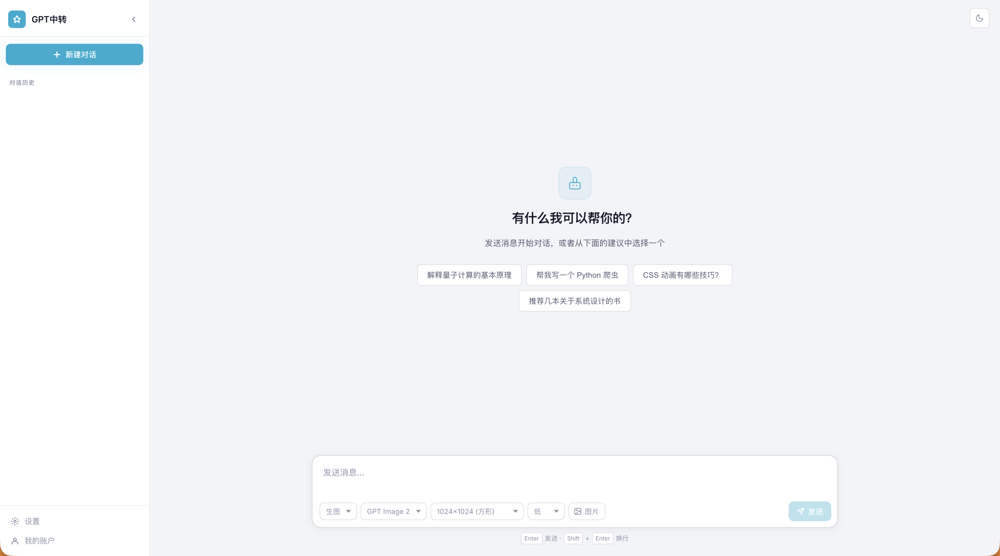

# gpt-image-2 生图工具
**需要自己配置url和key，本项目只是工具封装**

基于 GPT Image 2 的图片生成与编辑工具，React + Koa 前后端分离，支持文生图和图生图（参考图编辑）。



## 功能特性

- 🎨 文生图：输入提示词生成图片
- 🖼️ 图生图：上传参考图进行编辑
- 📐 尺寸与质量控制
- 📝 生图历史本地持久化（SQLite）
- 🌓 深色/浅色主题切换
- 🔧 灵活的 API 配置（支持自定义中转站地址）

## 快速开始

### 1. 安装依赖

```bash
npm install
npm run install:all
```

### 2. 配置 API

启动应用后，点击左下角的 **设置** 按钮，配置以下信息：

- **API 地址**：OpenAI API 兼容的中转站地址（例如：`https://your-api-proxy.com`）
- **生图 API Key**：用于 GPT Image 2 的 API 密钥

> 提示：需要中转站支持 `/v1/images/generations` 和 `/v1/images/edits` 接口。

### 3. 启动应用

```bash
npm run dev
```

启动后访问：
- 前端：http://localhost:5566
- 后端：http://localhost:6677

## 项目结构

```
frontend/          # React + Vite + TypeScript 前端
backend/           # Koa3 + SQLite 后端
data/              # 运行时数据（自动创建）
  ├── chat.db      # SQLite 数据库
  ├── images/      # 生成的图片文件
  └── config.json  # API 配置
```

## 使用说明

### 生成图片

在底部输入框输入提示词，按 **Enter** 或点击 **生成** 按钮。

### 编辑图片

点击 **参考图** 按钮上传一张或多张参考图，再输入编辑指令。

### 尺寸与质量

输入框工具栏可选择图片尺寸（方形/横向/竖向，最高 4K）和质量（低/中/高）。

### 管理历史

- **重命名**：鼠标悬停在历史记录上，点击编辑图标
- **删除**：鼠标悬停在历史记录上，点击删除图标
- **删除消息**：鼠标悬停在消息上，点击删除按钮

## 技术栈

- 前端：React 19 + TypeScript + Vite
- 后端：Koa 3 + better-sqlite3 + node-fetch

## 开发命令

```bash
npm run dev              # 并发启动前后端
npm run dev:frontend     # 仅启动前端
npm run dev:backend      # 仅启动后端
npm run install:all      # 安装所有依赖
```

## License

MIT
